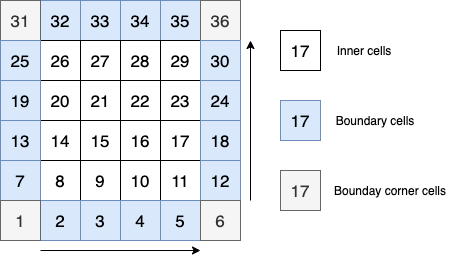
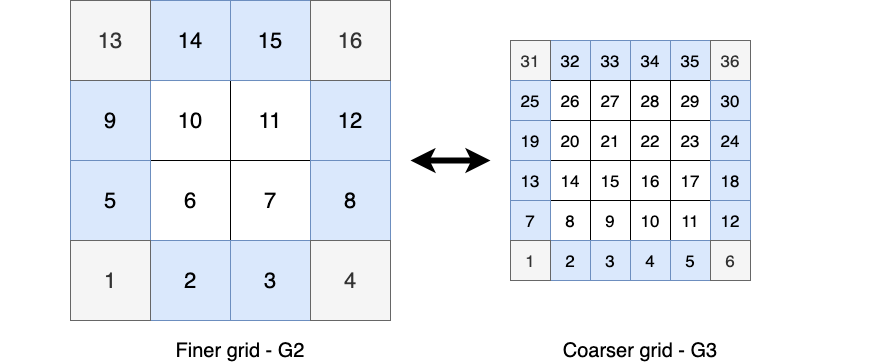
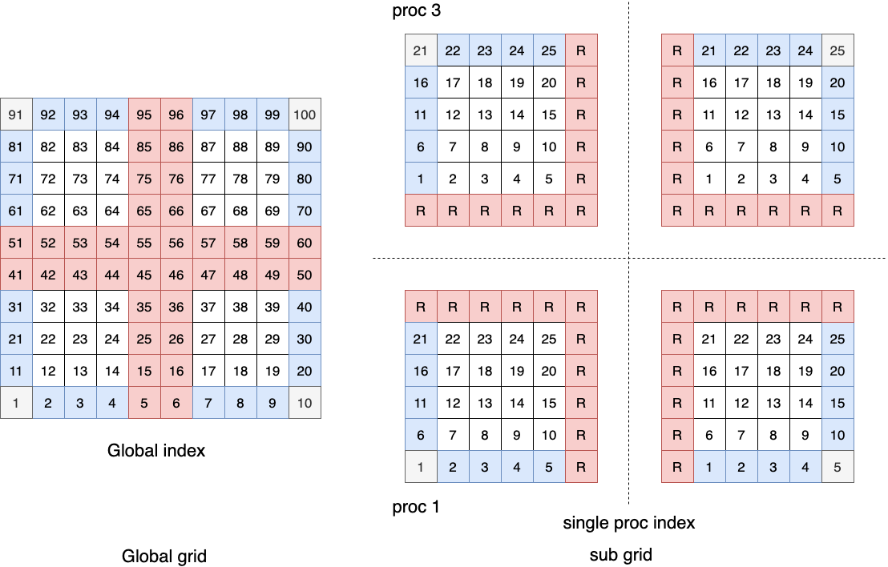
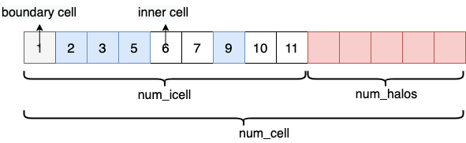
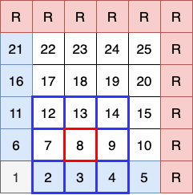
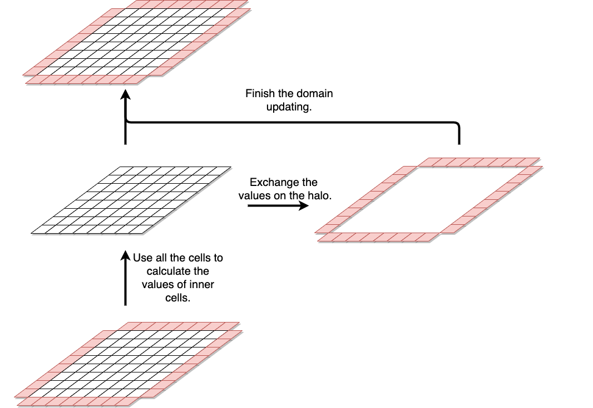
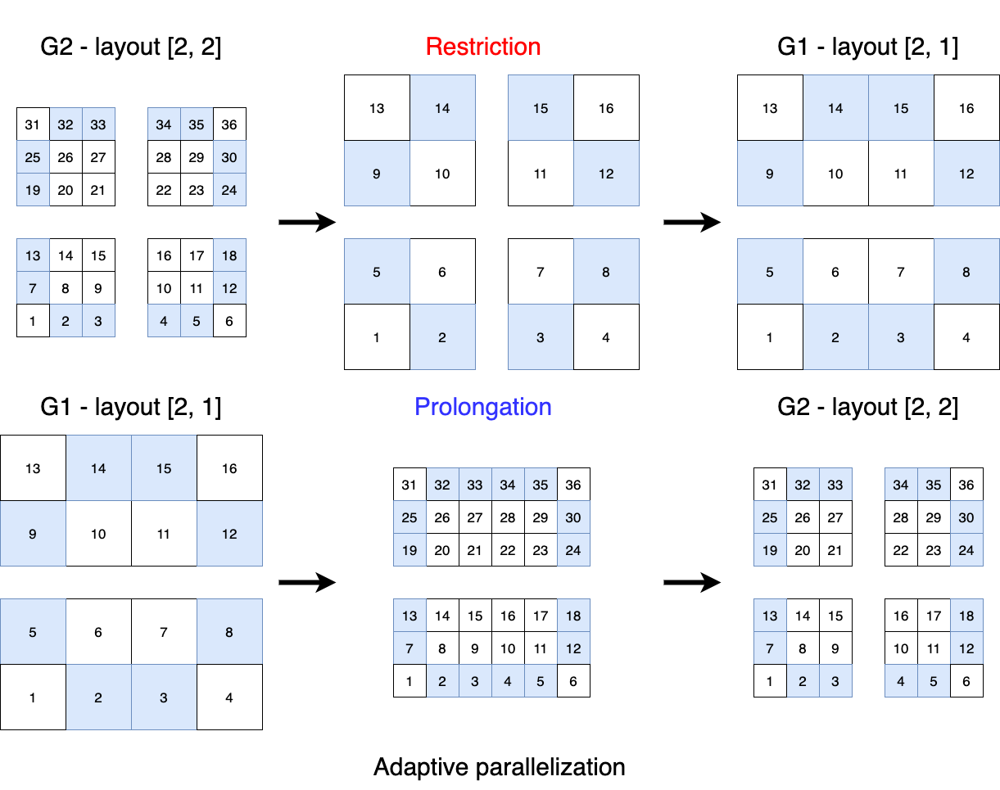

# mgGen

`mgGen` is a grid generator providing the unconstructed mesh data struct of both regional lat-lon grid and global icosahedral-triangle grid. `mgGen` is consisted of a series of tracers for computational operators such as horizontal derivatives, interpolations and, so on.

## Lat-Lon single grid 

In Lat-Lon single grid, the model variables are defined as 3-Dimensional arrays instead of 4D as shown below:

```fortran
    real(r_kind) :: psi(:, :, :)      ! vLevel/num_icell/tSlots
```

* For this 3D matrix, the first subscript indicates the vertical level index. 
* While the second subscript indicates the horizontal 2D cell index. E.g.:

<div style="text-align:center">

</div>

The order of the second horizontal index is from left to right, from bottom to top. The outermost cells are the fictitious boundary cells. To distinguish the inner cells from the boundary cells and boundary corner cells, the `cell_type` is defined as:

```fortran
    INTEGER(i_kind), ALLOCATABLE    :: cell_type(:)               !< num_cell,Type sign of cells: 0, inner, 1, boundary, 2, boundary corner, 3, halo
```

For `cell_type(i)` = 0, it is an inner cell; for `cell_type(i)` = 1, it is a boundary cell; for `cell_type(i)` = 2, it is a boundary corner cell; for `cell_type(i)` = 3, it is a halo cell.


* The third subscript is the time slot index.

A simple transverse of the grid is shown below:

```fortran
  DO i = 1, sg%vLevel          ! Vertical levels
    DO j = 1, sg%num_icell     ! Horizontal cells
      DO k = 1, sg%tSlots      ! Time slots
        if (sg%cell_type(j) == 0) then
          psi(i, j, k) = ...       ! Inner cells
        else if (sg%cell_type(j) == 1) then
          psi(i, j, k) = ...        ! Boundary cells
        else if (sg%cell_type(j) == 2) then
          psi(i, j, k) = ...        ! Boundary corner cells
        else if (sg%cell_type(j) == 3) then
          psi(i, j, k) = ...        ! Halo cells for mpi halo
        end if
      END DO
    END DO
  END DO
```


## Lat-Lon Multigrid

the `mlgrid` in the `mgGen` provides multigrid features. And every single grid is encapsulated in the `multiLevel_t` member class. Here is the schematic diagram of two adjacent grids:

<div style="text-align:center">

</div>

The area of the inner cells remains unchanged in the different multi-level grids, the boundaries are always one cell.

**Here the `mgGen` is not directly invoked by the users, in most times, it is encapsulated in the `geometry` class.** 

# geometry

`geometry` is an MPI-based parallel toolkit class providing grid tracers inherited from `mgGen` and parallel data manipulating functions on the model/analysis space. 

<!-- **geometry** and **mpdd** are only run the computation in horizontal layouts.  -->

`geometry` is based on the 2D unconstructed mesh grid `mgGen`. :

+ Multigrid is natively supported;
+ Unconstructed grid indices in horizontal;
+ MPI is supported, and high-level parallel operators are enclosed;
+ The global grid field has one layer of boundary cell.
+ **Operations in geometry is always vectorized** (in the vertical direction).

## Use of geometry

`geometry` has the dependency of library `mpdd`.

```fortran
! lib `mpdd` and `geometry` are both required
  USE mpddGlob_m, only: mpddGlob_t
  USE geometry_m, ONLY: geometry_t
  
  TYPE(mpddGlob_t), target :: mpddGlob
  TYPE(geometry_t), target :: geometry
  CHARACTER(LEN=1024) :: configFile = "$STATIC_DIR/test.nl"  ! test.nl template is in the folder STATIC_DIR

  CALL mpdd%initialize                          ! Initialize the mpdd
  CALL geometry%initialize(configFile, mpdd)    ! Initialize the geometry with mpdd
  ...                                           ! Other codes
  CALL geometry%destroy                         ! Destroy geometry 
  CALL mpdd%destroy                             ! Destroy mpdd
```

`geometry` is not the unique in the program. So one can define several `geometry`s from different config files for some purposes:
```fortran
  ...
  TYPE(geometry_t), target :: geometryLarge, geometrySmall
  CHARACTER(LEN=1024) :: configFile1 = "$STATIC_DIR/configFile1.nl"  ! Config 1
  CHARACTER(LEN=1024) :: configFile2 = "$STATIC_DIR/configFile2.nl"  ! Config 2

  CALL geometryLarge%initialize(configFile, mpdd)    ! Initialize the geometryLarge with configFile1.nl and mpdd 
  CALL geometrySmall%initialize(configFile, mpdd)    ! Initialize the geometrySmall with configFile1.nl and mpdd
  ...                                                ! Other codes
  CALL geometryLarge%destroy                         ! Destroy geometryLarge 
  CALL geometrySmall%destroy                         ! Destroy geometrySmall 
```

## Member of geometry

Similarly, geometry consisted a series of tracers for deploying interpolation, recursive filter and other applications:

```
geometry
├── mpdd                             % Global proc communicators
├── mg                               % Build directory
│   ├── sg(coarsest:finest)          % A series of single grids
│   │   ├── mpddInfo_sg              % Group proc communicators for each grid
│   │   ├── num_cell                 % Number of **total cells** on single grid and sub proc
│   │   ├── num_icell                % Number of **inner cells** on single grid and sub proc
│   │   ├── cell_type(num_cell)      % cell type indicator
│   │   ├── ...                      % member variables
│   │   ├── distGridReal             % Distribute the real matrix from base proc to all procs
│   │   └── ...                      % member functions of sg, operators on sg
│   └── ...                          % member functions of mg
└── ...                              % member functions of geometry
```

Noting that, `geometry` is constructed with a 2-level hierarchy: `geometry%mg` and `geometry%mg%sg`

+ `sg` is an array of single grids containing a series of tracers in each grid.
+ `geometry%mg%sg(i)` encapsulated a series of mapping arrays for manipulating horizontal cells. e.g.,
+ `geometry%mg%sg(i)%num_cell` is the total horizontal cell number for single grid level `i` and current proc rank.
+ `geometry%mg%sg(i)%distGridReal` is to ditribute the global matrix on proc 0 to all procs on single grid.
+ `mg` contains the `sg` arrays, and operators with two `sg` single grids.

## Domain decomposition with MPI

The MPI layout for each grid level is in 2D, which can be set in namelist files (e.g. `test.nl`). If the layout is `[2, 2]`, the total proceses is 4, and the geometry will distribute the inner cells of each grid level evenly to each process:

<div style="text-align:center">

</div>

+ The **sequential index of MPI procs (MPI layout)** is from left to right, from bottom to top;
+ The **sequential index of cells (grid layout)** in each proc in each cell is also from left to right, from bottom to top same with `mgGen`;
+ All the inner cells are evenly distributed to every proc, the procs on the MPI layout boundary would have boundary cells;
+ Cell arrays in each proc have not only the physical inner and boundary cells, but also have some fictitious exchange halo cells. 

`geometry` provided an automatic dividing and processing operation to distribute/scatter (`geometry%mg%sg(i)%distGridReal`) the above single proc structure to multiple procs, or aggregate/gather from multiple to base proc (`geometry%mg%sg(i)%aggrGridReal`) with giving MPI layout: 

```fortran
  SUBROUTINE distGridInt(bufSrc, bufDest, bufShape)           ! sg%distGridInt
    INTEGER(i_kind), INTENT(in) :: bufSrc(:, :, :, :), &      ! Buffer source, can be  1D/2D/3D/4D integer matrix
                                   bufShape(4)                ! Shape of buffer source (1D array), 
                                                              ! bufShape(4) should equal to this
    INTEGER(i_kind), INTENT(out) :: bufDest(:, :, :, :)       ! Buffer destination     1D/2D/3D/4D integer matrix
```

```fortran
  SUBROUTINE distGridReal(bufSrc, bufDest, bufShape)          ! sg%distGridReal
    INTEGER(i_kind), INTENT(in) :: bufSrc(:, :, :, :), &      ! Buffer source, can be  1D/2D/3D/4D real matrix
                                   bufShape(4)                ! Shape of buffer source (1D array)
    INTEGER(i_kind), INTENT(out) :: bufDest(:, :, :, :)       ! Buffer destination     1D/2D/3D/4D real matrix
```
## Arrangement of cell sequence on one proc

On each proc, the inner and boundary cells are places on the first `num_icell` slots of total `num_cell` cells. The sequence order of halo cells is random, but they are indexed by `cell_stcl` and other mapping variables.

<div style="text-align:center">

</div>

### Data allocation with geometry

To use the `geometry`, the model/analysis space data should be allocated with the size below:

```fortran
    REAL(i_kind), ALLOCATEABLE :: psi(:,:)
    REAL(i_kind), ALLOCATEABLE :: vc(:,:,:)

    ALLOCATE(psi(vLevel, num_cell)) 
```

Any matrice input to the geometry associated function should have their length of last dimension equaling to `sg(i)%num_cell` on their grid level `i`. Or just use the internal function to initialize the dynamical arrays:

```fortran
  SUBROUTINE allocateMat(gLevel, buf)        ! sg%allocateMat
    INTEGER(i_kind), INTENT(IN) :: vLevel    !< Vertical levels of grid
    REAL(r_kind), ALLOCATABLE :: buf(:, :)   !< Buffer address
```

## Using of unconstructed mesh

As the cells in the mesh is following the sequence above, the developer could use the index from 1 to `num_icell` to traverse the entire region, in this way, the direction of traversal is from left to right, from bottom to top. mgGen provides a tracer: `cell_stcl` for developers to implement other traversal strategies.
#### cell_stcl

`cell_stcl` is a 2D matrix that indexes the adjacent stencil cells. E.g.:

<div style="text-align:center">

</div>

In the grid above:

```
cell_stcl(:, 8) = (2, 3, 4, 7, 8, 9, 12, 13, 14)
```

Thus, the developer could use the edge_stcl to navigate to traverse the grid from bottom to top, from left to right.

## Computing with geometry and mpdd

Since the introduction of mpdd, the coding on each grid differs from that of the single proc.

<div style="text-align:center">

</div>

As shown in the figure above, we should only calculate the values on the inner and boundary cells (index from 1 to `num_icell` on each `sg`), and use the function `sg(i)%ExchangeMatOnHalo` to exchange and update the cells on the halo to finish the calculation.

```fortran
  SUBROUTINE exchangeMatOnHalo(vlevel, exBuf)                 ! sg%exchangeMatOnHalo          
    INTEGER(i_kind), INTENT(in) :: vlevel                        ! Number of vertical level
    REAL(r_kind), INTENT(inout) :: exBuf(vlevel, this%num_cell)  ! Operation buffer
```
`sg%distGridRealWithHaloEx` is a combination of `sg%distGridReal` and `sg%exchangeMatOnHalo`, it would distribute the matrix from the base proc to each single proc firstly, then update their halos.

```fortran
  SUBROUTINE distGridRealWithHaloEx(bufSrc, bufDest, bufShape)   ! sg%distGridRealWithHaloEx
    INTEGER(i_kind), INTENT(in) :: bufSrc(:, :, :, :), &      ! Buffer source, can be  1D/2D/3D/4D real matrix
                                   bufShape(4)                ! Shape of buffer source (1D array)
    INTEGER(i_kind), INTENT(out) :: bufDest(:, :, :, :)       ! Buffer destination     1D/2D/3D/4D real matrix
```
## Adaptive parallelization

As the grid goes coarser, the layout of MPI may not suitable to the grid extension. Thus we introduce the **Adaptive parallelization (AP)**, which could run the grid with different layouts on each level.

AP generates the group MPI communicator for each single grid in the `sg%mpddInfo_sg`. Thus, to operate the vectors and matrice on a single grid, it is **necessory** to use the communicator and ranks in `mpddInfo_sg`

### AP on single grid

The `sg%mpddInfo_sg` is extended from type `mpddSub_t`:

```fortran
  TYPE mpddSub_t
    INTEGER(i_kind) :: group                              ! MPI group id
    INTEGER(i_kind) :: ierr                                  ! MPI error handler
    INTEGER(i_kind) :: comm                               ! MPI group communicator
    INTEGER(i_kind) :: STATUS(MPI_STATUS_SIZE)

    INTEGER(i_kind) :: nProc                              ! Number of procs on this grid
    INTEGER(i_kind) :: rank                               ! Rank number of this grid
    INTEGER(i_kind) :: myrank                             ! myrank  = rank + 1
  CONTAINS
    PROCEDURE, PUBLIC, PASS   :: init_proc_layout            
    PROCEDURE, PUBLIC, PASS   :: dest_proc_layout
    PROCEDURE, PUBLIC, PASS   :: isActiveProc
    PROCEDURE, PUBLIC, PASS   :: isBaseProc
    ...
```

### Connection between two single grids.

The `layout` on each grid level can be set in the `namelist.nl`.

<div style="text-align:center">

</div>

The matrix on each grid will be restricted or prolongated on their proc, then aggregate to the coarser or finer grid level: `geometry%mg%restrictionAtGLevel`, `geometry%mg%prolongationAtGLevel`.

```fortran
  SUBROUTINE prolongationAtGLevel(gLevel, vLevel, bufFiner, bufCoarser, isUpdateBndy)
    INTEGER(i_kind), INTENT(IN) :: gLevel, &                   !< Current multigrid level of grid
                                   vLevel                      !< Vertical level of the grid
    REAL(r_kind), INTENT(OUT) :: bufFiner(vLevel, this%sg(gLevel + 1)%num_cell)   !< Buffer address at finer level
    REAL(r_kind), INTENT(IN) :: bufCoarser(vLevel, this%sg(gLevel)%num_cell)      !< Buffer address at coarser level
    LOGICAL, INTENT(IN), optional :: isUpdateBndy              !< Whether prolongate the cells on the boundary
```

```fortran
  SUBROUTINE restrictionAtGLevel(gLevel, vLevel, bufFiner, bufCoarser, isUpdateBndy)
    INTEGER(i_kind), INTENT(IN) :: gLevel, &                   !< Current multigrid level of grid
                                   vLevel                      !< Vertical level of the grid
    REAL(r_kind), INTENT(IN) :: bufFiner(vLevel, this%sg(gLevel)%num_cell)          !< Buffer address at finer level
    REAL(r_kind), INTENT(OUT) :: bufCoarser(vLevel, this%sg(gLevel - 1)%num_cell)   !< Buffer address at coarser level
    LOGICAL, INTENT(IN), optional :: isUpdateBndy              !< Whether prolongate the cells on the boundary
```